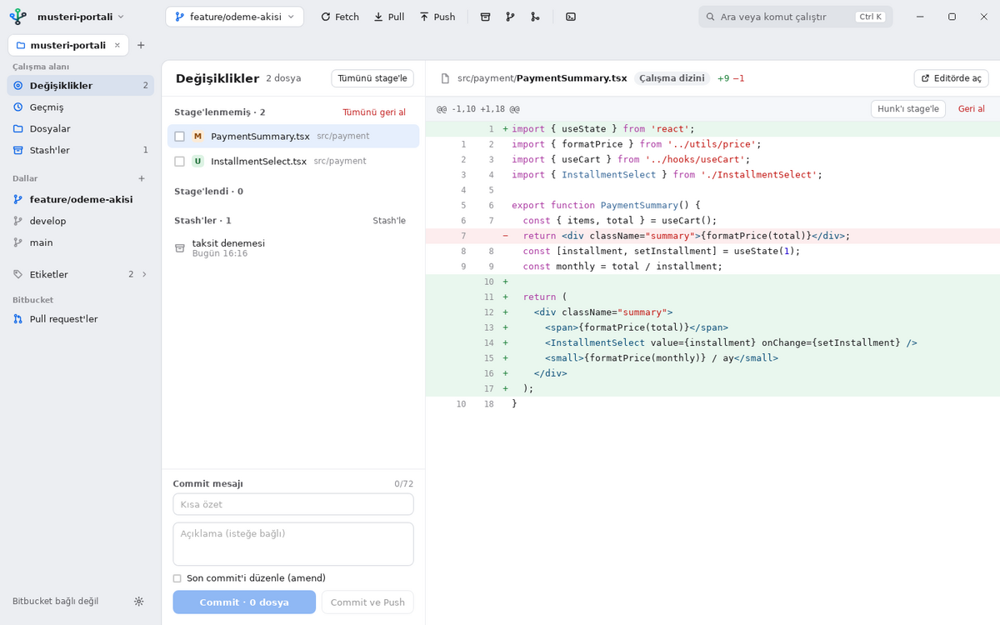
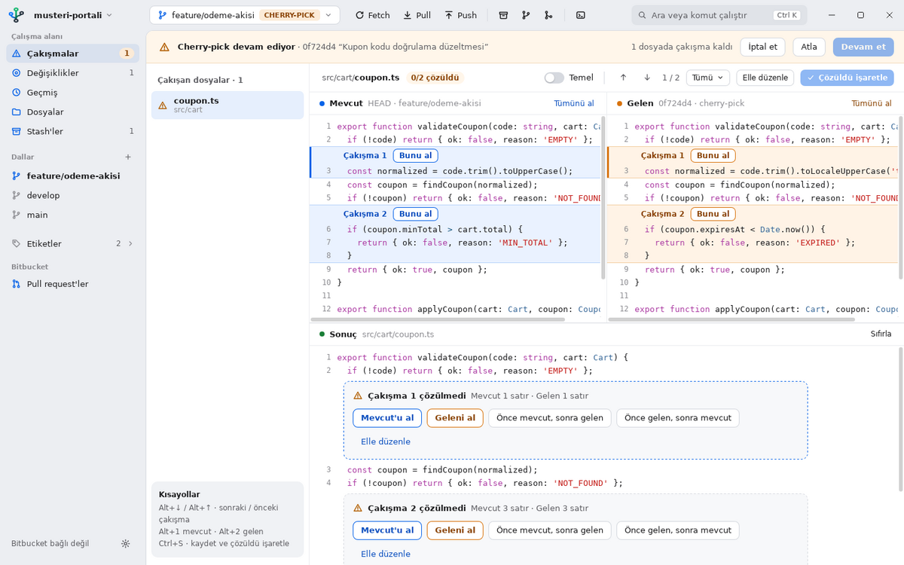
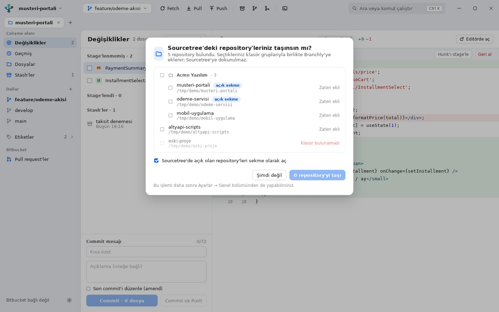
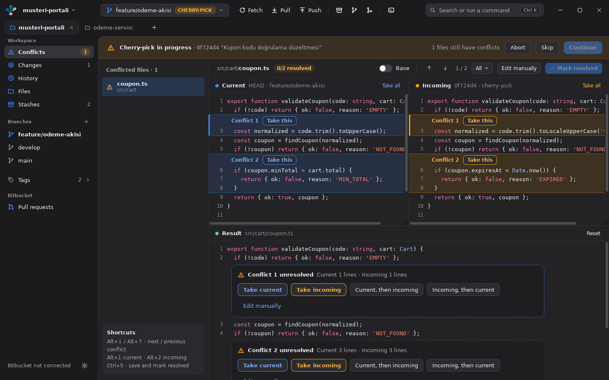
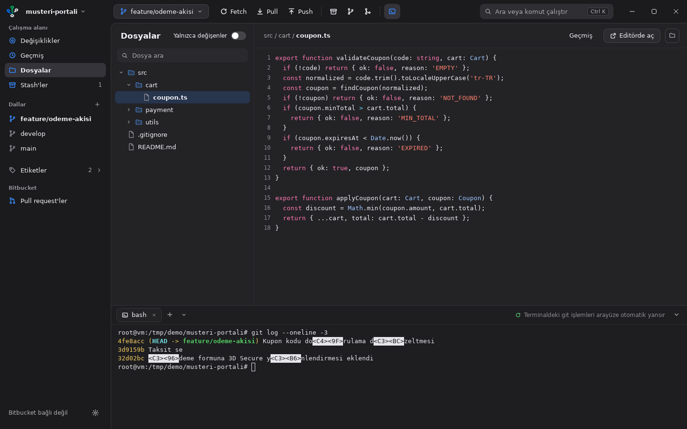

# Branchly

Windows için hafif, modern bir Git istemcisi. Arayüz **Türkçe ve İngilizce** kullanılabilir. Sourcetree'ye alternatif olarak tasarlandı; öne çıkan özelliği uygulama içinden **3 yönlü çakışma (conflict) çözümü**.



## Özellikler

| Alan | İçerik |
|---|---|
| **Değişiklikler** | Dosya, hunk ve **satır bazında** stage / unstage / geri alma, commit, amend, "Commit ve Push" |
| **Stash** | Oluştur (takip edilmeyenler dahil), uygula, pop, sil |
| **Geçmiş** | Dal grafiği, arama, commit ayrıntısı ve dosya farkları; sağ tık ile **cherry-pick**, revert, dal/etiket oluşturma, reset (soft/mixed/hard) |
| **Çakışma çözücü** | Mevcut / Gelen panelleri, isteğe bağlı Temel (base) paneli, düzenlenebilir Sonuç; blok başına 5 seçenek; merge, cherry-pick, revert, rebase ve stash pop için Devam et / Atla / İptal et; ikili dosya ve silindi/değiştirildi çakışmaları; CRLF satır sonları korunur |
| **Dosyalar** | Git durum rozetli dosya ağacı, "yalnızca değişenler" filtresi, sözdizimi renkli önizleme, harici editörde açma, Dosya Gezgini'nde gösterme |
| **Terminal** | Gömülü terminal (Git Bash, PowerShell 7, Windows PowerShell, cmd, WSL); çoklu sekme; **açık/koyu temaya uyar**; terminalde yapılan git işlemleri arayüze otomatik yansır |
| **Bitbucket Cloud** | OAuth 2.0 ile giriş; PR listesi (açık, bana atanan, benim, birleşen); PR ayrıntısı, yorumlar, dosya farkları, commit'ler, Pipelines durumu; onayla / değişiklik iste / birleştir; dalı checkout et; yeni PR oluştur |
| **Çoklu repository** | Açık repository'ler sekme olarak durur (Ctrl+Tab ile geçiş, Ctrl+W ile kapatma); klasör gruplu repository kütüphanesi; terminal oturumları sekme değişiminde kapanmaz |
| **Sourcetree'den geçiş** | İlk açılışta Sourcetree'deki repository listesi (`%LOCALAPPDATA%\Atlassian\SourceTree\bookmarks.xml`) bulunursa taşımak isteyip istemediğiniz sorulur; klasör grupları ve açık sekmeler korunur. Sonradan Ayarlar → Genel'den de yapılabilir. Sourcetree'nin dosyalarına yalnızca okuma amaçlı erişilir |
| **Genel** | Türkçe / English arayüz, Açık / Koyu / Sistem teması, Ctrl+K komut paleti, dal değiştirici, fetch / pull / push, merge, rebase, klonlama, git komut günlüğü |






## Kurulum dosyasını üretme

Kurulum dosyası iki yoldan üretilebilir.

### Seçenek A: GitHub Actions (önerilen, bilgisayarınıza bir şey kurmanız gerekmez)

1. Bu klasörü bir GitHub repository'sine push edin.
2. **Actions → Windows build → Run workflow**.
3. İş bittiğinde **Artifacts** altından `Branchly-Windows` dosyasını indirin. İçinde `Branchly_0.1.0_x64_en-US.msi` ve `Branchly_0.1.0_x64-setup.exe` bulunur.

### Seçenek B: Kendi Windows bilgisayarınızda

Gerekenler (bir kez kurulur):
- [Node.js 20+](https://nodejs.org)
- [Rust](https://rustup.rs): kurulum sırasında istenen **Visual Studio C++ Build Tools**'u da kurun
- [Git for Windows](https://git-scm.com)

Derlemek için:

```powershell
powershell -ExecutionPolicy Bypass -File .\build-windows.ps1
```

Çıktılar `src-tauri\target\release\bundle\msi\` ve `...\nsis\` klasörlerine yazılır.

Geliştirme modunda çalıştırmak için: `npm install` ardından `npm run tauri dev`.

## Bitbucket bağlantısı (bir kez)

1. Bitbucket'ta **Workspace settings → OAuth consumers → Add consumer**.
2. **Callback URL:** `http://127.0.0.1`
3. **This is a private consumer** seçeneğini işaretleyin.
4. İzinler: *Account: Read*, *Repositories: Read, Write*, *Pull requests: Read, Write*.
5. Branchly'de **Ayarlar → Bitbucket** bölümüne Key ve Secret'ı girip **Bitbucket ile giriş yap**'a tıklayın. Tarayıcı açılır, onay verdiğinizde uygulama bağlanır.

Secret ve erişim anahtarları Windows Kimlik Bilgisi Yöneticisi'nde (Credential Manager) saklanır. Anahtar süresi dolduğunda otomatik yenilenir.

## Klavye kısayolları

| Kısayol | İşlem |
|---|---|
| Ctrl+K | Komut paleti |
| Ctrl+1 / 2 / 3 / 4 | Değişiklikler / Geçmiş / Dosyalar / Pull request'ler |
| Ctrl+\` | Terminali aç / kapat |
| Ctrl+Shift+S | Stash |
| Ctrl+Shift+N | Yeni dal |
| Ctrl+O | Repository aç |
| Ctrl+Tab / Ctrl+Shift+Tab | Sonraki / önceki repository sekmesi |
| Ctrl+W | Repository sekmesini kapat |
| Ctrl+Enter | Commit (mesaj alanında) |
| Alt+↓ / Alt+↑ | Sonraki / önceki çakışma |
| Alt+1 / Alt+2 | Mevcudu al / geleni al |
| Ctrl+S | Çakışmayı kaydet ve çözüldü işaretle |
| F5 | Yenile |

## Mimari

- **Kabuk:** Tauri 2 (Rust) + WebView2. Kurulum boyutu yaklaşık 5–10 MB, boşta düşük bellek kullanımı.
- **Arayüz:** React + TypeScript, kendi tasarım sistemi (`src/styles.css`, açık/koyu tema değişkenleri).
- **Git:** Sistemdeki `git` çağrılır. Böylece hook'lar, SSH ve Git Credential Manager olduğu gibi çalışır. Satır bazında staging `git apply --cached` ile, çakışma içeriği `git merge-file --diff3` ile üretilir.
- **Terminal:** portable-pty (Windows'ta ConPTY) + xterm.js.
- **Bitbucket:** OAuth 2.0 authorization code akışı, yerel `127.0.0.1` geri dönüş adresi, REST API 2.0.

```
src-tauri/src/
  git.rs         git komutları, durum/geçmiş ayrıştırma, çakışma, kısmi yama (+ testler)
  pty.rs         gömülü terminal
  files.rs       dosya ağacı, önizleme, editör, repository izleyici
  bitbucket.rs   OAuth ve API
  sourcetree.rs  Sourcetree repository listesini içe aktarma (+ testler)
  i18n.rs        arka uç mesajlarının dili
src/
  views/         Değişiklikler, Geçmiş, Çakışmalar, Dosyalar, Pull request'ler
  components/    Başlık çubuğu, kenar çubuğu, terminal, diff görüntüleyici, diyaloglar
  i18n.ts        Türkçe / English çeviri sözlüğü
  lib/           diff ayrıştırma ve yama üretimi, grafik yerleşimi, çakışma ayrıştırma
```

Rust testleri: `cd src-tauri && cargo test` (kısmi staging, cherry-pick çakışma akışı, CRLF koruma).

## Bilinen sınırlar (0.1.0)

- Bitbucket **Data Center** (kurum içi sunucu) desteği henüz yok; yalnızca Bitbucket Cloud.
- Kurulum dosyası **imzasız**; ilk çalıştırmada Windows SmartScreen uyarı verebilir ("Ek bilgi → Yine de çalıştır"). Dağıtım için bir kod imzalama sertifikası önerilir.
- Interactive rebase (sürükle-bırak), blame ve submodule/LFS ekranları sonraki sürümler için planlandı.
